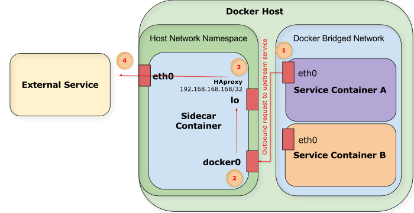

Docker Support
==============

This directory contains the basics to build and start a Docker container that
runs Sidecar. To work properly the container assumes that it is run in host
networking mode. The command line arguments required to run it on are in the
`run` script in this directory:

```bash
IMAGE=$1
echo "Starting from $IMAGE"
docker run -i -t -v /var/run/docker.sock:/var/run/docker.sock \
	--label SidecarDiscover=false \
	-e SIDECAR_SEEDS="127.0.0.1" \
	--net=host \
	--cap-add NET_ADMIN $IMAGE
```

**Volume Mount:** Requires volume mounting the Docker socket. If you choose
not to do this, then you'll need to pass in `DOCKER_*` environment variables to
configure access to the Docker daemon. You'll also want to remove the whole
configuration line `docker_url` from the `sidecar.toml` file.

**Label:** This prevents Sidecar from discovering itself, which, when it
happens, is a pretty useless discovery.

**Networking:** Requires host-based networking to work. Various pitfalls lie
in not doing this, including difficulty of all the containers of finding
HAproxy, and also inability for Sidecar to be reachable from outside without
additional port mappings.

**Capabilities:** We add the `NET_ADMIN` capability to the container to allow it
to bind a IP address for HAproxy when the container starts. This is *optional*
and only required if you are using a specific IP address for the HAproxy
binding.

**Environment Variables:** This tells the container to look to itself as
the seed. You'll want to set this to one or more IP addresses or hostnames
of the cluster seed hosts.

```
SIDECAR_SEEDS="seed1 host2 seed3" # Required
ADVERTISE_IP="192.168.168.5" # Optional
```

The seed hosts passed via `SIDECAR_SEEDS` are formatted as
`--cluster-ip` arguments to Sidecar.

As mentioned above, the default configuration is all set up with the
expectation that you will map `/var/run/docker.sock` into the container.  This
is where Docker usually writes its Unix socket. If you want to use TCP to
connect, you'll need to do some more work and pass in `DOCKER_*` environment
variables to configure access to it from Sidecar.

How It Works
------------

This is an overview of how the networking works when Sidecar is running in a
container. The following diagram depicts a service running on the Docker host making a request to an upstream service while leveraging Sidecar for service discovery:



1. The service running in Service Container A makes a request to External
   Service. This request leaves the `eth0` interface, the container's default
   route, and traverses the Docker bridged network. 
2. The request enters the host's network namespace and the Sidecar Container
   via the docker0 bridge interface. The request is bound for 192.168.168.168
   which is bound to the loopback interface, so it is forwarded there.
3. HAproxy answers the request on 192.168.168.168 and it is bound for a
   recognized port with live backends. The request is then forwarded out to
   External Service via the host's default route, its `eth0`.
4. The request leaves the host, with the host's public address on the `eth0`
   interface as the source. The service running as External Service receives the
   request directly from HAproxy on the Docker host.

Testing
-------

A good way to test out if your system is working, is to deploy the official
Nginx container and see if it shows up in discovery. The following command line
will do that:

```
$ docker run --label HealthCheck=HttpGet \ # Specify HttpGet health check type
	--label ServicePort_80=8080 \  # Map 8080 to exposed port 80
	--label ServicePort_443=8443 \ # Map 8443 to exposed port 443
	--label HealthCheckArgs="http://{{ host }}:{{ tcp 8080 }}/" \ # Health check this URL
	-d -P nginx                    # Detach and map ports
```
